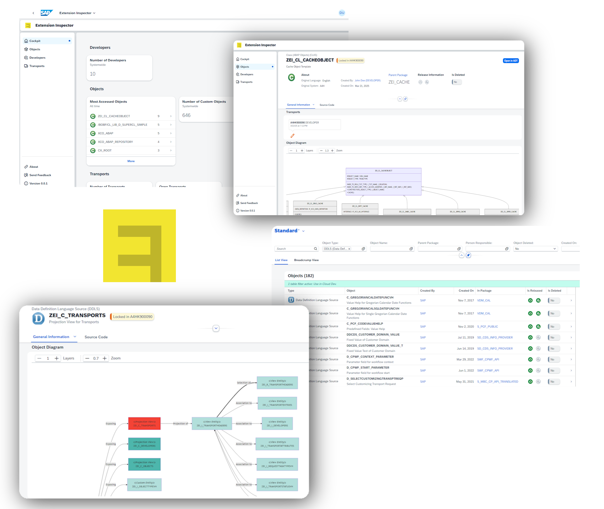

<a id="readme-top"></a>


<br />
<div align="center">
  <a href="https://github.com/othneildrew/Best-README-Template">
    
  </a>

  <h3 align="center">Extension Inspector</h3>

  <p align="center">
    Get the big picture of your S/4HANA system - gain control, clarity, and actionable insights.
    <br />
    <br />
    <a href="https://github.com/extension-inspector/extension-inspector/issues/new?labels=bug">Report Bug</a>
    &middot;
    <a href="https://github.com/extension-inspector/extension-inspector/issues/new?labels=enhancement">Request Feature</a>
  </p>
</div>
<br />

> [!WARNING]  
> This project is currently under **very active** development. Expect bugs and breaking changes.


## About The Project

<br />

### What this tool can do
- List all **development objects, developers and transports** and navigate between them
- Check **class diagrams** of your extensions and understand how they interconnect
- Visualize the **hierarchies of data definitions**, service definitions and bindings

### What this tool is planned to become
- Combining loose development objects into **building blocks** to get a better understand of your system (e.g. RAP-based Odata Services, BAdI Implementations, ...)
- A **professional search** feature, that lets you search objects based on their attributes and links between each other (e.g. find classes which are accessing from data definitions that do have an access control, ...)
- A **extension map** of the whole system, giving you better control on how to evolve your extension landscape
- Professional **KPI's** to monitor developments, cloud readiness, and much more


## Prerequisits
_Minimum requirements to make use of this tool._
- S/4HANA on-premise or private cloud edition at least in release 2022
- Application Jobs must be enabled and configured
- [ABAPGit](https://github.com/abapGit/abapGit) must be available on your system in version 1.130.0 or higher for the inital setup


## Getting Started
_Follow the instructions below to get started with the app on your own S/4HANA System._

### Creation of the Backend
1. Create a local packge in your S/4HANA system
2. Clone this repository into the package via [ABAPGit](https://github.com/abapGit/abapGit)
3. Open transaction `/iwfnd/v4_admin` and publish the odata service `ZEI_UI_O4`

### Deployment of the Frontend
1. Open VSCode and clone this repository
2. Change the directory to `frontend` and install all modules

   ```sh
   npm i
   ```
3. Define a `ui5-deploy.yaml`
   - **Option 1 - Use the provided template file (recommended):**
   Remove the suffix `.template` from the file `ui5-deploy.yaml.template` in the `frontend` folder.
   Replace the placeholders of the template file (Hostname, Port, Client, ABAP Package and Transport Request).

   - **Option 2 - Generate a new file:**
   In VSCode command palette (`CTRL+Shift+P`) search for "Fiori: Add Deployment Configuration".
   A UI-based generator will open up. Follow the steps of the generator to create `ui5-deploy.yaml`.
4. Deploy the app to your S/4HANA system

   ```sh
   npm run deploy
   ```
   
5. Done! Now you can open the app standalone by selecting _right click --> Test_ on the deployed BSP file or by adding the app to your Fiori Launchpad (App ID `com.extension-inspector.extension-inspector`).

### Creating Object Caches
_Generating the caches is necessary for the app to be able to show diagrams and understand links between different development objects._
1. Open the Standard App 'Application Jobs' (F1240)
2. Create a one-time or scheduled job based on the job template `ZEI_REFRESH_OBJECTCACHE_JT`


## Third Party Libraries in this Project

 [mermaid](https://github.com/mermaid-js/mermaid)
&middot;
 [panzoom](https://github.com/anvaka/panzoom)

<p align="right">(<a href="#readme-top">back to top</a>)</p>
